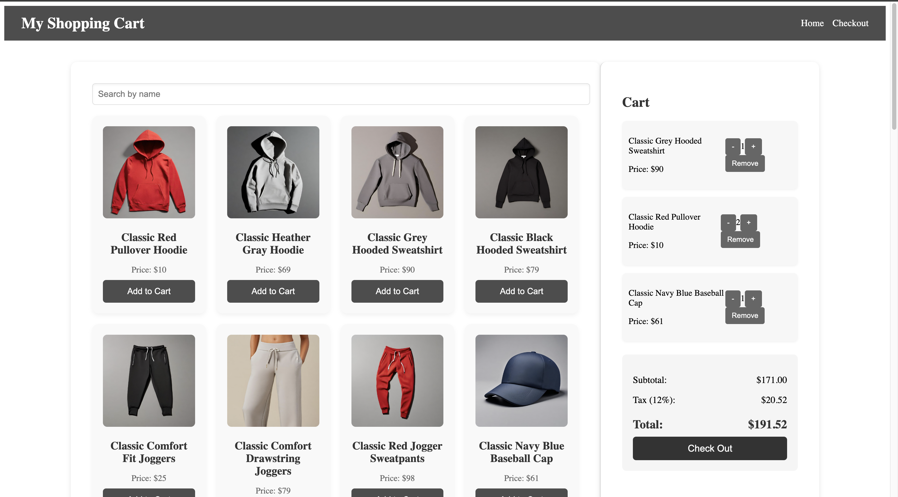

# Shopping Cart Application

A simple and efficient shopping cart application built with **React** and **Vite**. This app enables users to browse products, add items to a cart, view a cart summary, and proceed to checkout. The project leverages the **Platzi Fake Store API** for product data.

## Features

- **Product Search**: Search for products by name to find what you need quickly.
- **Add to Cart**: Add selected products to your shopping cart.
- **Cart Management**: View and adjust the quantity of items in your cart.
- **Detailed Cart Summary**: See a summary with subtotal, tax, and total calculations.
- **Checkout**: Complete your purchase with a simple payment confirmation.

## Getting Started

Follow these instructions to set up and run the project on your local machine.

### Prerequisites

Ensure you have **Node.js** and **npm** installed on your machine. Download them from [Node.js](https://nodejs.org/).

### Installation

1. **Clone the repository**:

   ```bash
   git clone https://github.com/<your_github_username>/shopping-cart.git

   ```

2. **Navigate to the project directory**:

   ```bash
   cd shopping-cart
   ```

3. **Install dependencies**:

   ```bash
   npm install
   ```

4. **Running the Project**:
   To start the project in development mode, run:

   ```bash
   npm run dev
   ```

   This will start the Vite development server. Open your browser and go to http://localhost:5173 to view the application.

## Libraries and Tools Used

| Library / Tool                                   | Description                                     |
| ------------------------------------------------ | ----------------------------------------------- |
| [**Vite**](https://vitejs.dev/)                  | Fast frontend build tool                        |
| [**React**](https://reactjs.org/)                | JavaScript library for building user interfaces |
| [**React Router DOM**](https://reactrouter.com/) | Declarative routing for React applications      |
|                                                  |

```bash
_Project Structure_
shopping-cart/
├── index.html # Entry HTML file
├── package.json # Project configuration and dependencies
├── vite.config.js # Vite configuration
├── src/
│ ├── App.css # Global CSS for the application
│ ├── App.jsx # Main application component with routes
│ ├── main.jsx # Entry point for the React application
│ ├── components/
│ │ ├── Cart.jsx # Cart component displaying items in the cart
│ │ ├── CartItem.jsx # Component for individual items in the cart
│ │ ├── ProductItem.jsx # Component for individual products
│ │ └── ProductList.jsx # Component for displaying the list of products
│ └── pages/
│ ├── CheckoutPage.jsx # Checkout page with order summary
│ └── HomePage.jsx # Home page displaying products and cart
└── public/
└── assets/ # Any static assets like images or icons
```

API
This project uses the Platzi Fake Store API to fetch product data.


This template provides a minimal setup to get React working in Vite with HMR and some ESLint rules.

Currently, two official plugins are available:

- [@vitejs/plugin-react](https://github.com/vitejs/vite-plugin-react/blob/main/packages/plugin-react/README.md) uses [Babel](https://babeljs.io/) for Fast Refresh
- [@vitejs/plugin-react-swc](https://github.com/vitejs/vite-plugin-react-swc) uses [SWC](https://swc.rs/) for Fast Refresh

# Happy Coding! mwa 🫡
